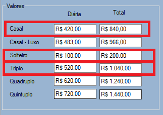

# Introduction
<h3>
Hello! Thanks for reading my project!
</h3>

The idea of this project is to calculate the value of the daily rate for a specific schadule's range. I use Mysql to store all the daily expenses prices.

The program also have CRUD so you do not have to make any changes using MySql interface.

This is my very first program, that I created in order to help my parents' hotel.

If you find any bugs or have sugestions, please give me a feedback in my e-mail adress: benni.vichel@hotmail.com

Thanks again!

# How it Works

The end customer will choose a start date and an end date in the program.

The program will fetch the values ​​on the specified date and return them to the customer's screen.

## Sections

 ### Section 1 (valores)

In this section, we have the attributes:

double room

luxury double room

single value

triple room

quadruple room

quintuple room

The "single value" is not the value for a room with single bed, but it's the value the program uses to calculate the cost for the triple,quadruple and quintuple rooms

Example:

In the image the double room value is R$ 420,00. Adding the "single value(solteiro)" with the "double room value(casal)" we get the "triple room value(triplo)".

double room (420,00)+ single value(100,00) = triple room (520,00).

We do exactly the same thing to quadruple and quintuple rooms.

### Section 2 (Quarto customizado)

In section 1 we only have room prices for guests over 10 years old. To find out the value of, for example, a triple room with a couple and a child, we use section 2.

Add the amount in each field and click the calculate daily rate button(calcular diárias).

The base value in section 2 will always be the value of the double room.

### Section 3 (Quarto customizado)

In section 3 the calculated number of daily rates will be shown

