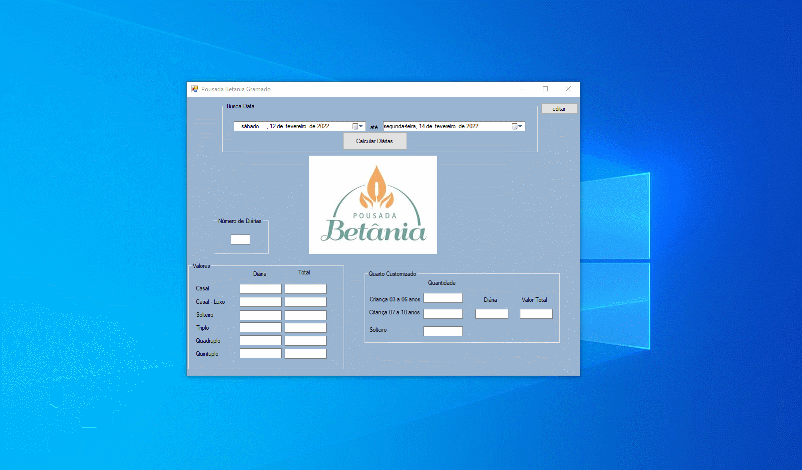
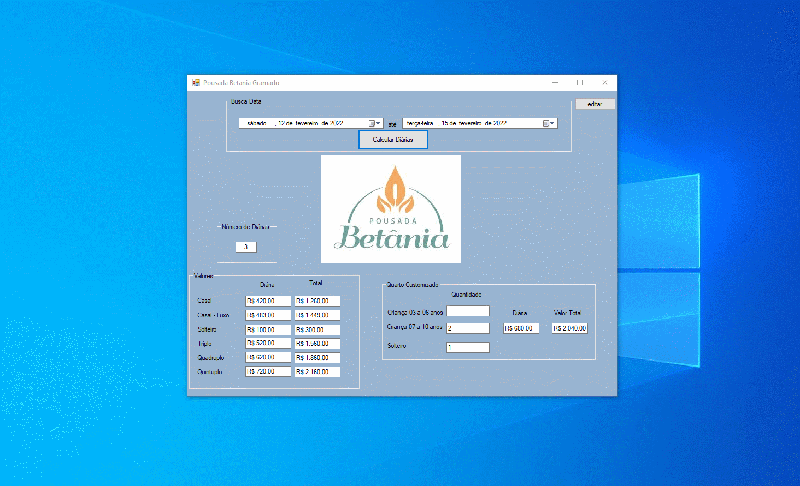
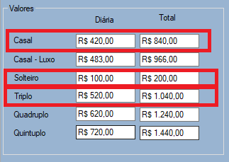
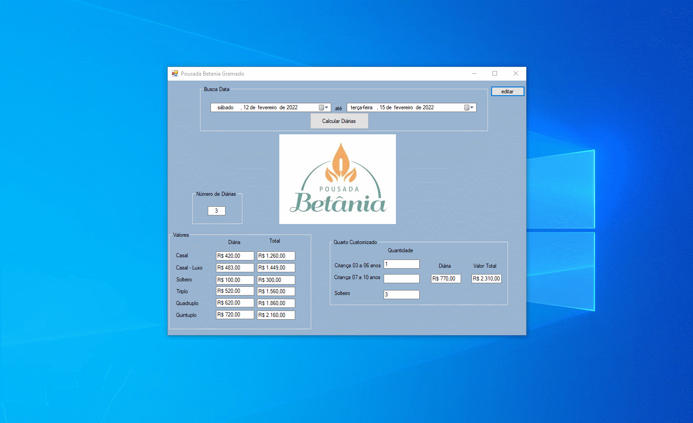
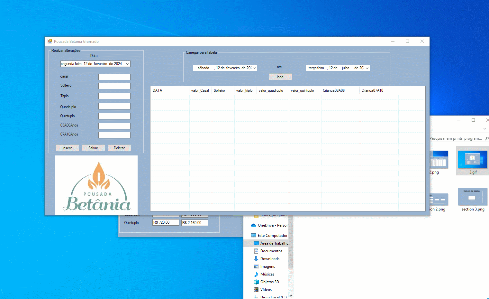

# CSharp-Calculate-Hotel-Daily-Rate

A desktop application built for a Brazilian pousada to automate the daily rate calculation process for guest budget quotations — replacing manual lookups and reducing human error in hospitality billing workflows.

## Purpose

Calculating daily rates manually across multiple room types and date ranges is error-prone and time-consuming. This application was built to solve a real operational need: given a date range, the system automatically fetches the correct pricing from a MySQL database and calculates the total for each room type instantly.

If you find any bugs or have suggestions, feel free to reach out: benni.vichel@hotmail.com

## How It Works

The staff selects a start date and an end date. The system fetches the pricing values for that range from the database and displays the calculated totals on screen.

## Sections

### Section 1 — Room Rates

Displays the daily rate and total price for each room type:

- 🛌 Casal (Double room)
- 🛌 Casal Luxo (Luxury double room)
- 🛌 Solteiro (Single base value)
- 🛌 Triplo (Triple room)
- 🛌 Quádruplo (Quadruple room)
- 🛌 Quíntuplo (Quintuple room)

Rooms with three or more guests are calculated by adding the single base value to the double room rate.

Example: Double (R$ 420,00) + Single (R$ 100,00) = Triple (R$ 520,00). The same logic applies to quadruple and quintuple rooms.

### Section 2 — Custom Room Calculator

For mixed-age groups (e.g. a couple with a child), staff can input the exact guest composition and receive the correct rate. The base value always corresponds to the double room rate.

### Section 3 — Results

Displays the final calculated daily rates for the selected period.

## Admin Panel

Pricing values can be updated at any time through the built-in CRUD panel.

## Tech Stack

- Language: C# — .NET Framework 4.8
- Database: MySQL (WampServer 3.3.2)
- IDE: Visual Studio Community 2019 (v16.11.33)
